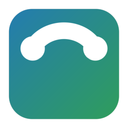

# FRITZ!Box Calllist

[](https://github.com/RF1705/fritzbox-calllist/actions/workflows/hacs.yml)
[](https://github.com/RF1705/fritzbox-calllist/actions/workflows/hassfest.yml)
[](https://buymeacoffee.com/rf1705)
[](LICENSE)



A HACS-compatible Home Assistant custom integration for FRITZ!Box call monitor sensors.

FRITZ!Box Calllist turns an existing call monitor sensor into a small phone dashboard:

- live call state for ringing, dialing and active calls
- persistent call history
- call duration for live and completed calls
- optional reverse lookup for unknown phone numbers using a configurable provider chain

## Installation

### Install with My Home Assistant

[](https://my.home-assistant.io/redirect/hacs_repository/?owner=RF1705&repository=fritzbox-calllist&category=integration)

### Manual HACS installation

1. Add this repository to HACS as a custom repository:

   ```text
   https://github.com/RF1705/fritzbox-calllist
   ```

2. Select the `Integration` category.
3. Install `FRITZ!Box Calllist`.
4. Restart Home Assistant.
5. Go to **Settings > Devices & services > Add integration**.
6. Search for `FRITZ!Box Calllist`.
7. Select your FRITZ!Box call monitor sensor.

FRITZ!Box Calllist is a regular Home Assistant integration. It is not registered as a helper.

## Support

If you find this integration useful, you can support the project here:

[buymeacoffee.com/rf1705](https://buymeacoffee.com/rf1705)

## License

This project is licensed under the MIT License.

## Lovelace Card

The Lovelace card is distributed separately:

[RF1705/fritzbox-calllist-card](https://github.com/RF1705/fritzbox-calllist-card)

Install it through HACS as a Lovelace card and point it at the sensor created by this integration.

## Configuration

The setup dialog asks for:

- the call monitor sensor entity
- the number of stored call entries

The integration creates a FRITZ!Box Calllist device and one feed sensor entity.

## Reverse Lookup

The integration creates one disabled-by-default reverse lookup switch per provider on the FRITZ!Box Calllist device.

When at least one provider switch is enabled, unknown phone numbers can be sent to the enabled providers for reverse lookup. Results are cached locally in Home Assistant storage, so the same number does not need to be looked up again. If a name is found while a call is still active, the live call display is refreshed and the following history entry uses the cached name as well.

This feature is opt-in because phone numbers are personal data and are sent to a third-party provider.

### Cache Management

Open the integration options via **Settings > Devices & services > FRITZ!Box Calllist > Configure** to manage cached reverse lookup names.

You can:

- view cached `name (number)` entries
- delete one cached entry
- delete the whole reverse lookup cache

Provider order:

```text
dasoertliche.de,11880.com,dasschnelle.at,herold.at,search.ch,tellows.de
```

The order is fixed for now. The first enabled provider that returns a usable name wins. `tellows.de` is intentionally last because it is more community/spam oriented than a classic phone directory.

Supported providers:

- `dasoertliche.de`
- `11880.com`
- `dasschnelle.at`
- `herold.at`
- `search.ch`
- `tellows.de`

## Sensor Attributes

The feed sensor exposes these attributes:

- `history`: stored call entries
- `live`: current live call information
- `is_active`: whether a call is currently ringing, dialing or active
- `callmonitor_entity`: the configured source sensor
- `reverse_lookup_providers`: currently enabled reverse lookup provider order

## Supported Call States

FRITZ!Box Calllist expects a call monitor sensor using these states:

- `ringing`
- `dialing`
- `talking`
- `idle`
